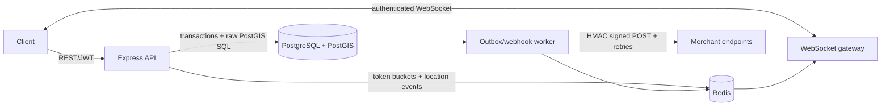
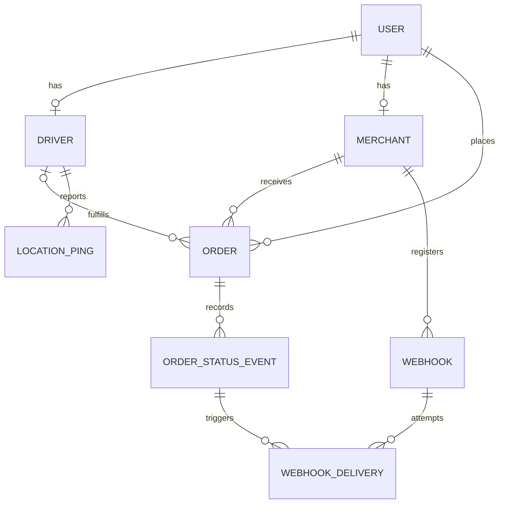

# Delivery Tracking API

A production-oriented logistics backend demonstrating transactional state
machines, PostGIS proximity search, out-of-order location correctness,
authenticated live updates, and durable webhook delivery.

## Architecture



The API, audit event, webhook-delivery records, and outbox event are committed
together. Background workers claim work with `FOR UPDATE SKIP LOCKED`; Redis
and external HTTP are never part of the request transaction.

## Data model



## Run locally

Requirements: Node.js 20+, Docker with Compose, and optional k6.

```bash
cp .env.example .env
npm install
docker compose up --build
```

The application container applies migrations before starting. For a host-run
API instead:

```bash
docker compose up -d postgres redis
npm run db:migrate -- --envPath .env
npm run dev
```

Validation commands:

```bash
npm run typecheck
npm run lint
npm test
npm run build
```

REST documentation is in [`docs/openapi.yaml`](docs/openapi.yaml). Operational
endpoints are `GET /health` and `GET /metrics`.

## Core correctness decisions

### Geography rather than geometry

Locations use `geography(Point, 4326)`. Distances are metres on the spheroid,
which is accurate across a city or country without choosing a local projection.
`geometry` can be faster and has broader function support, but requires careful
projection selection for meaningful metres. GiST indexes cover driver, merchant,
order, and ping locations. Nearby search uses `ST_DWithin` for index filtering,
then `ST_Distance` only for the reduced result set.

To prove index use against representative seeded data, run:

```sql
EXPLAIN (ANALYZE, BUFFERS)
SELECT id FROM drivers
WHERE status = 'available'
  AND ST_DWithin(
    current_location,
    ST_SetSRID(ST_MakePoint(3.3792, 6.5244), 4326)::geography,
    5000
  );
```

The expected plan contains `Bitmap Index Scan` or `Index Scan` on
`drivers_current_location_gist_idx`. Exact output is intentionally not checked
in because it depends on row count, statistics, hardware, and PostgreSQL version.

### State machine and concurrency

One lookup table is the source of truth for all 64 possible status pairs.
Transitions lock the order with `SELECT ... FOR UPDATE`, update status, append
exactly one audit event, enqueue webhooks, and write an outbox event in one
transaction. Clients may send `expected_status`; a stale concurrent request gets
`409`, while a genuinely invalid transition gets `422`. A partial unique index
guarantees one active order per driver even if application checks race.

### Location ordering

Every ping is appended. The current driver point advances only through an atomic
conditional update where `recorded_at` is newer than `location_updated_at`.
Thus delayed mobile retries remain in history but cannot regress live state. At
larger scale, `location_pings` would be range-partitioned by `recorded_at` with a
retention/archive policy.

### Outbox and Redis Pub/Sub

Publishing inside the order request would create a database/Redis dual-write
failure window. The transaction stores an outbox row; a worker later publishes
it and marks it complete. Redis Pub/Sub is appropriate for ephemeral live views:
durable truth remains in PostgreSQL and reconnecting clients rebuild via REST.
Streams would be preferable if each real-time consumer required durable replay.

## WebSocket events

Connect to `WS /ws/orders/:id` with `Authorization: Bearer <token>`. Browser
clients unable to set upgrade headers may use `access_token` in the query string
over TLS; reverse proxies must redact query strings. Only the customer, assigned
driver, owning merchant, or an administrator can subscribe.

- `subscribed`: authorization succeeded.
- `status_changed`: outbox-published status update.
- `driver_location_updated`: newly committed current driver point.

## Webhook reliability

The registration response exposes the secret once. Receivers compute
HMAC-SHA256 over the exact raw body, prefix the hex digest with `sha256=`, and
constant-time compare it with `X-Signature`. `event_id` enables deduplication.

Failures retry after 1s, 5s, 30s, 5m, and 30m. After six total attempts the job
is `exhausted` and visible through the delivery-history endpoint. Claims are
crash-safe: a worker reserves an attempt before external I/O, and an abandoned
claim becomes eligible again.

## Observability and rate limiting

Logs are structured JSON and preserve or generate `X-Request-ID`. Prometheus
metrics include HTTP count/latency/status, location-ping latency, webhook
outcomes, and Node process metrics. Redis-backed token buckets use Redis server
time and an atomic Lua script. Location ingestion has a separate per-driver
bucket after authentication.

## Load test

Create `load/driver-tokens.json` containing access tokens for seeded drivers,
then run 200 concurrent drivers, each pinging every three seconds:

```bash
k6 run -e BASE_URL=http://localhost:3000 \
  -e DRIVER_TOKENS_FILE=./load/driver-tokens.json \
  load/location-pings.js
```

The script enforces p95 below 250ms and failures below 1%. Benchmark numbers are
not fabricated in this repository: record throughput and p95 from the target
machine alongside its CPU, memory, database size, and k6 summary.

## Delivery milestones

- [x] Service scaffold, Docker Compose, PostGIS, Redis, health endpoint
- [x] Database schema and spatial indexes
- [x] Authentication and role authorization
- [x] Transactional order state machine
- [x] Location ingestion and nearby-driver search
- [x] Orders and driver assignment
- [x] Authenticated WebSocket delivery
- [x] Reliable webhook worker and transactional outbox
- [x] Redis token-bucket rate limiting and Prometheus metrics
- [x] OpenAPI contract, architecture docs, and k6 scenario
- [ ] Record environment-specific `EXPLAIN ANALYZE` and k6 results
